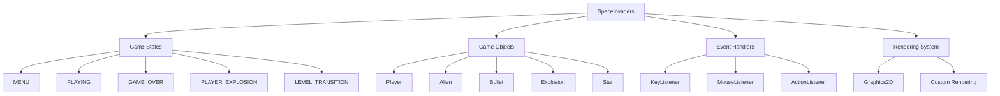
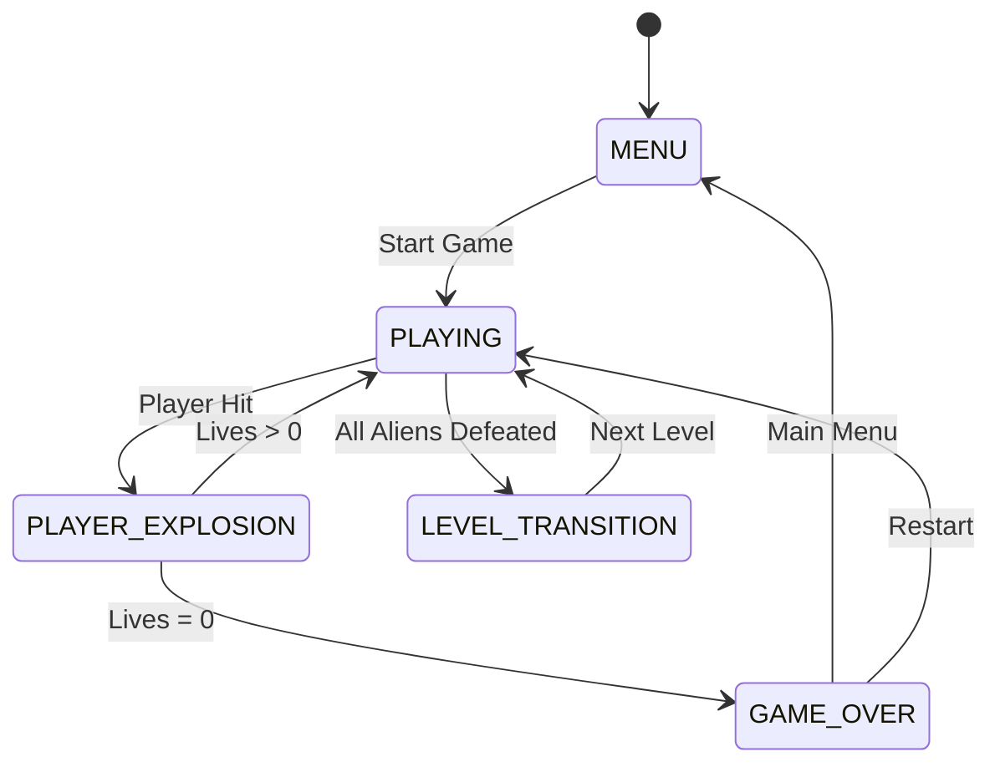
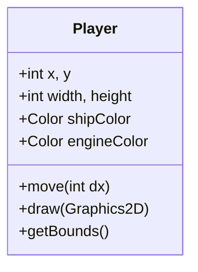
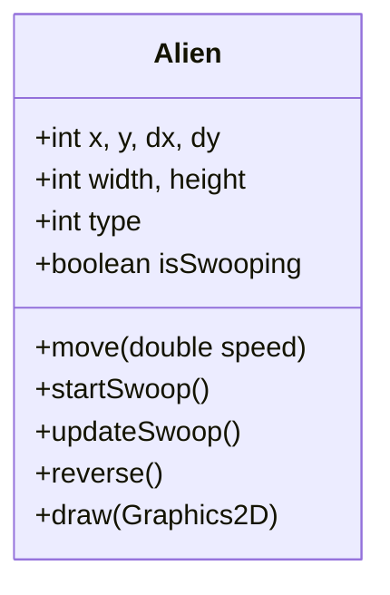
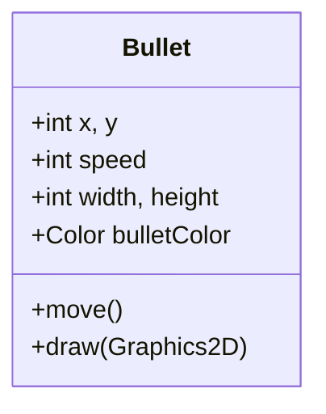
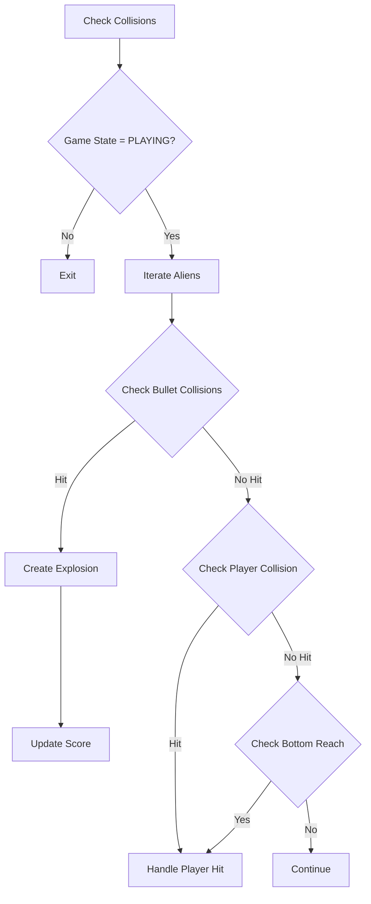
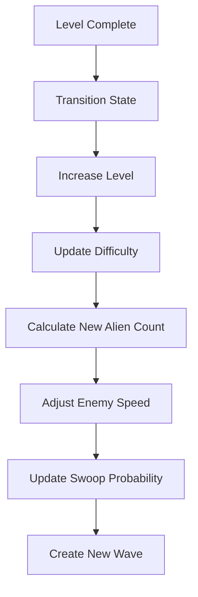
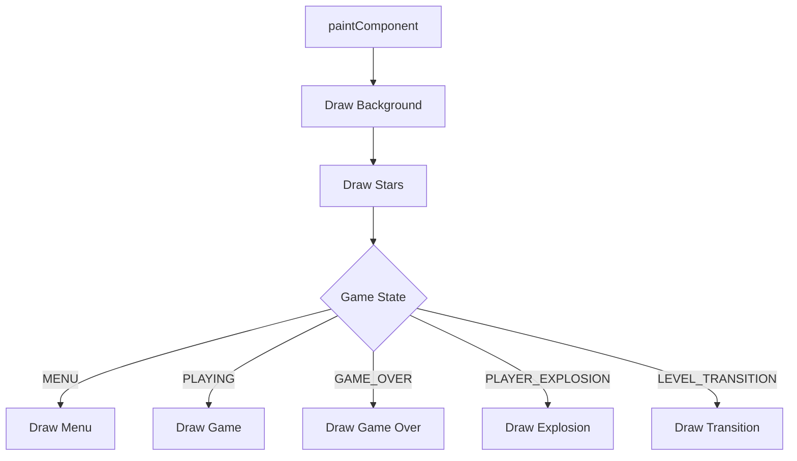
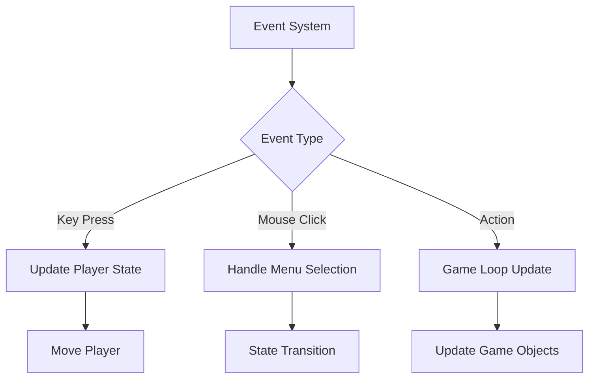

# Space Invaders Game


## Overview
A modern implementation of the classic Space Invaders arcade game using Java Swing. The game features enhanced graphics, dynamic difficulty scaling, and multiple game states.

## Game Architecture

### Core Components


### Game State Flow


## Component Details

### 1. Game States
- **MENU (0)**: Initial state with start/exit options
- **PLAYING (1)**: Active gameplay state
- **GAME_OVER (2)**: End game state with score display
- **PLAYER_EXPLOSION (3)**: Player death animation state
- **LEVEL_TRANSITION (4)**: Level completion transition

### 2. Game Objects

#### Player


#### Alien


#### Bullet


### 3. Game Logic Flow

#### Collision Detection


#### Level Progression


## Game Features

### 1. Dynamic Difficulty
- Alien count increases per level
- Enemy movement speed scales
- Swoop probability increases
- Maximum aliens capped at 40

### 2. Visual Effects
- Star field background
- Explosion animations
- Player death effects
- Level transition animations
- Menu glow effects
- Button hover states

### 3. Controls
- Left/Right Arrow Keys: Move player
- Space: Shoot
- Mouse: Menu navigation

### 4. Scoring System
- Base score: 10 points per alien
- Score multiplier based on alien type
- High score tracking
- Level progression tracking

## Technical Implementation

### Rendering Pipeline


### Event Handling


## Performance Considerations
- Synchronized bullet list access
- Efficient collision detection
- Optimized rendering with Graphics2D
- Frame rate management
- Memory-efficient object pooling

## Future Enhancements
1. Power-up system
2. Boss battles
3. Sound effects
4. Save game state
5. Multiplayer support
6. Custom alien patterns
7. Achievement system 

## Graphics Enhancement Goals
- Implement sprite-based rendering for smoother animations
- Add particle effects for explosions and engine trails
- Create custom alien designs with multiple animation frames
- Implement dynamic lighting effects
- Add background parallax scrolling
- Improve menu animations and transitions
- Create custom fonts and UI elements
- Add screen shake and impact effects
- Implement dynamic color schemes

## Contributing
We welcome contributions to improve the game! Here are some areas where help is needed:

### Graphics Improvements
- Design and implement new alien sprites
- Create animated explosion effects
- Design custom UI elements
- Implement visual feedback for player actions
- Add background elements and decorations

### Code Contributions
- Optimize rendering pipeline
- Implement new game features
- Fix bugs and improve performance
- Add new game mechanics
- Enhance collision detection

### How to Contribute
1. Fork the repository
2. Create a feature branch
3. Make your changes
4. Submit a pull request

### Contribution Guidelines
- Follow Java coding conventions
- Add comments for complex logic
- Include documentation for new features
- Test changes thoroughly
- Keep performance in mind

## How to Run

### Prerequisites
- Java Development Kit (JDK) 8 or higher
- Java Runtime Environment (JRE)

### Compilation
1. Open a terminal/command prompt
2. Navigate to the project directory
3. Compile the game:
```bash
javac SpaceInvaders.java
```

### Running the Game
1. After successful compilation, run:
```bash
java SpaceInvaders
```

### Alternative: Using an IDE
1. Open the project in your preferred Java IDE (e.g., IntelliJ IDEA, Eclipse, VS Code)
2. Locate `SpaceInvaders.java`
3. Run the `main` method

### Troubleshooting
- If you get a "Class not found" error, ensure you're in the correct directory
- If you get a "Java not found" error, verify your Java installation and PATH settings
- For display issues, ensure your system supports Java Swing

---
## Author
John Morfidis